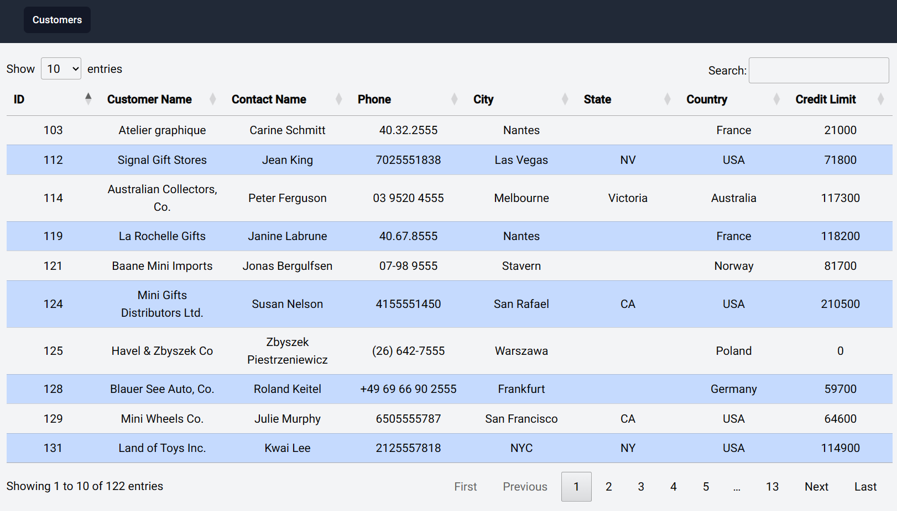
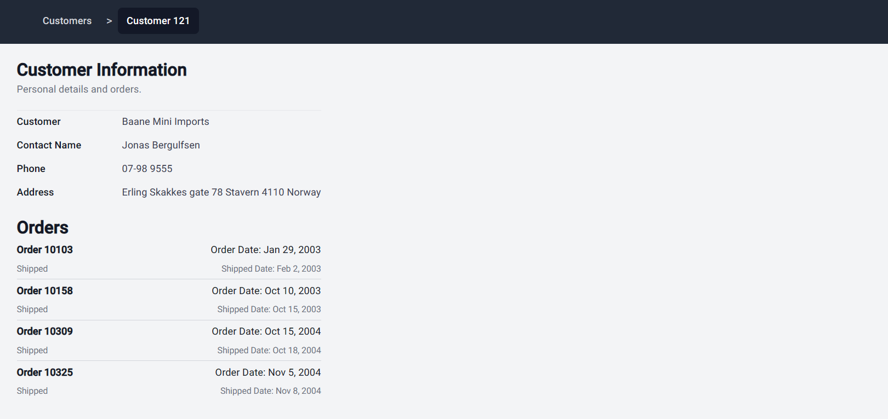
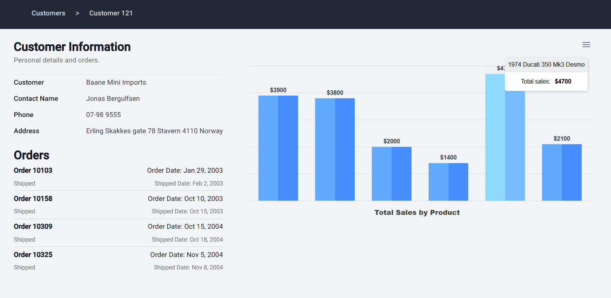

## Classic Models Dashboard

The project consists of a dashboard that displays information about a company's customers and their orders.

### Features

The dashboard displays the customers in a table with the ability to search, sort and paginate the customers. The dashboard also displays the orders of the selected customer in a bar chart.

### Technologies

The dashboard is made as a Single Page Application (SPA) using Angular v14.2.11, Tailwind CSS v3.3.2, and [Angular Datatables](https://l-lin.github.io/angular-datatables/#/welcome) for the display of the customers in table, with serverside processing for searching, sorting and pagination. In the addition of the use of [Apexcharts](https://apexcharts.com/) for the display of the orders details in a bar chart.\
The backend is made using .NET 6.0 and Entity Framework Core 6.0. The API is made using [DTOs](https://docs.microsoft.com/en-us/aspnet/web-api/overview/data/using-web-api-with-entity-framework/part-5) for the data transfer between the API and the frontend. The API is also using [Swagger](https://swagger.io/) for the documentation of the API. And it's using generic types for the service handling DataTables operations to make it reusable for other tables.\
Everything is containerized using Docker and docker-compose. The frontend is served using Nginx. The database is using MySQL 5.7 and is provided for the project in the `docker-compose.yml` file.

### Data

The project is made using the `classicmodels` database. The database is a sample database created by MySQL and can be downloaded from [here](https://www.mysqltutorial.org/mysql-sample-database.aspx/). The database is a simple database containing information about a company that sells scale models of classic cars. The database contains 8 tables and the schema is shown below:
[](https://www.mysqltutorial.org/wp-content/uploads/2009/12/MySQL-Sample-Database-Schema.png)

### How to run

To run the project you need to have Docker and docker-compose installed on your machine. Then you can run the following command in the root directory of the project:

```bash
docker-compose up -d --build
```

This will build the images and run the containers. The frontend will be served on port 4200 and the API on port 5000.

### Screenshots

- Customers table:\
  
- Customer details:\
  
- Orders chart:\
  
